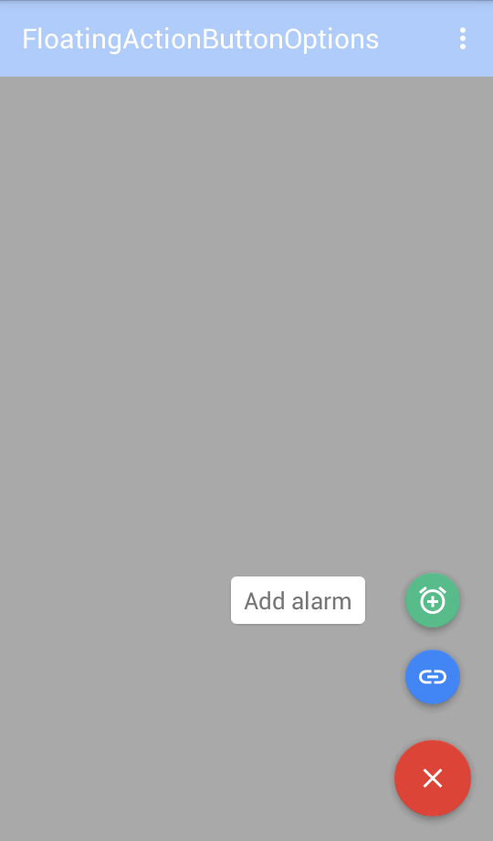

# Floating-Action-Menu
Floating action menu is a library allowing easily integrate fully customizable FloatingActionButton menu.
# Screenshots



# Download
Gradle:
```groovy
compile 'com.github.arthurghazaryan:floatingactionmenu:1.0.0'
```
# Usage
1. Define a menu in `res/menu` folder.
```xml
<?xml version="1.0" encoding="utf-8"?>
<menu xmlns:android="http://schemas.android.com/apk/res/android">
    <item
        android:id="@+id/fab_link"
        android:icon="@drawable/ic_link_white_24dp"
        android:title="" />

    <item
        android:id="@+id/fab_add"
        android:icon="@drawable/ic_add_alarm_white_24dp"
        android:title="@string/fab_1" />
</menu>
```
For each item add only 2 attributes `title` and `icon`.
2. Add `com.github.ag.floatingactionmenu.OptionsFabLayout` view  to your layout.
```xml
    <com.github.ag.floatingactionmenu.OptionsFabLayout
        android:id="@+id/fab_l"
        android:layout_width="wrap_content"
        android:layout_height="wrap_content"
        custom:color="@color/colorAccent"
        custom:options_color="@color/colorPrimary"
        custom:options_menu="@menu/fab_menu"
        custom:open_src="@drawable/ic_add_white_24dp"
        custom:close_src="@drawable/ic_close_white_24dp" />
```
3. Set mini fabs colors using `setMiniFabsColors` method(this is optional,you can define one color for all mini fabs using `options_color` attribute). 
```Java
fabWithOptions = (OptionsFabLayout) findViewById(R.id.fab_l);

        //Set mini fab's colors.
        fabWithOptions.setMiniFabsColors(
                R.color.colorPrimary,
                R.color.green_fab);
```
4. Handle main fab and mini fabs clicks.
```Java
       //Set main fab clicklistener.
        fabWithOptions.setMainFabOnClickListener(new View.OnClickListener() {
            @Override
            public void onClick(View view) {
                Toast.makeText(MainActivity.this, "Main fab clicked!", Toast.LENGTH_SHORT).show();
            }
        });

        //Set mini fabs clicklisteners.
        fabWithOptions.setMiniFabSelectedListener(new OptionsFabLayout.OnMiniFabSelectedListener() {
            @Override
            public void onMiniFabSelected(MenuItem fabItem) {
                switch (fabItem.getItemId()) {
                    case R.id.fab_add:
                        Toast.makeText(
                                getApplicationContext(),
                                fabItem.getTitle() + " clicked!",
                                Toast.LENGTH_SHORT).show();
                        break;
                    case R.id.fab_link:
                        Toast.makeText(getApplicationContext(),
                                fabItem.getTitle() + "clicked!",
                                Toast.LENGTH_SHORT).show();
                    default:
                        break;
                }
            }
        });
```
# Customize
| Attrubte | Description |
|:-----------:|:-----------:|
| options_menu| menu that contains mini fabs | 
| options_color         | sets same color for all mini fabs.Default value is `primary color`|
| open_src         | main fab drawable before opening menu           |
| close_src         | main fab drawable when menu is opened          |
|color | main fab color|
|background_color|color of background view when menu expanded|

Close menu
```Java
fabWithOptions.closeOptionsMenu();
```
Check if menu opened
```Java
fabWithOptions.isOptionsMenuOpened();
```
